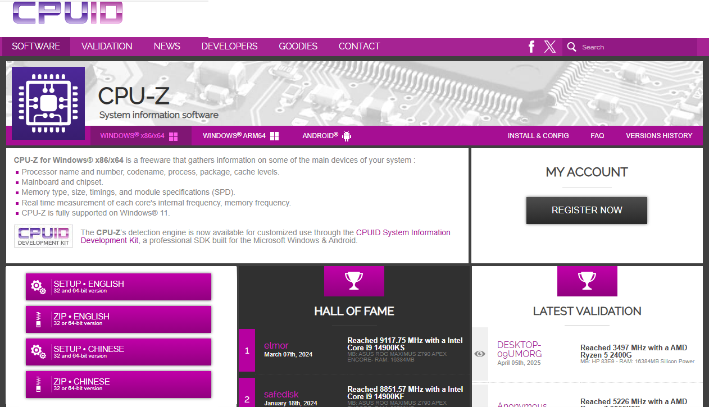
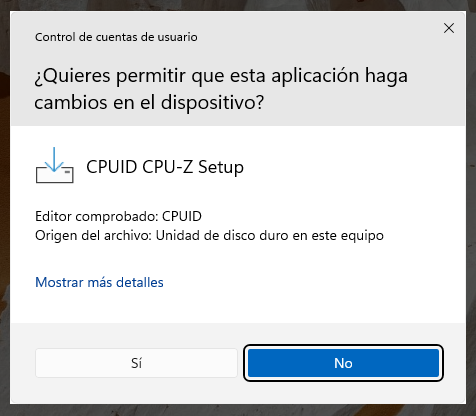
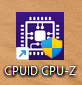
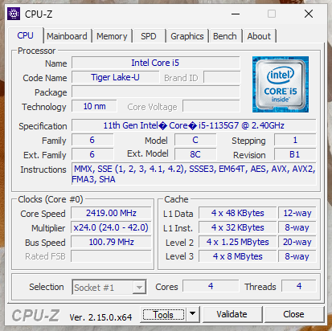
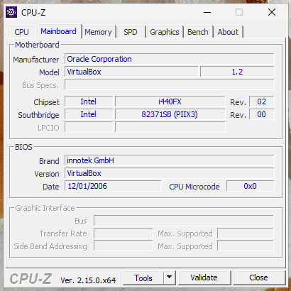

# CPU-Z

 

  

<h3>CPU-Z</h3>

CPU-Z es una herramienta de diagnóstico gratuita que proporciona información detallada sobre los componentes principales de un sistema, especialmente útil para usuarios que desean conocer las especificaciones técnicas de su hardware o para overclockers y entusiastas que necesitan monitorizar el rendimiento.

Podemos descargarlo desde su [página oficial](https://www.cpuid.com/softwares/cpu-z.html)

Elegimos la versión que corresponda con nuestro sistema y la descargamos, nos deja elegir entre bajar un .zip o el .exe.

 

Una vez descargada, ejecutamos el instalador, aceptamos términos, elegimos ubicación para la instalación y continuamos hasta que se complete la instalación.

 
 
Y veremos en nuestro escritorio un acceso directo a la apliación.

 

Lo ejecutamos y se nos abrirá el programa, como se ve, la primera pantalla que nos aparece es un analisis de nuestra **CPU**.

* **Nombre y modelo** : Identifica el procesador.
* **Código y tecnología** : Muestra la arquitectura y proceso de fabricación (ej. 10 nm).
* **Frecuencias** : Velocidad actual del núcleo, multiplicador y bus de sistema.
* **Instrucciones** : Conjuntos de instrucciones soportados.
* **Caché** : Detalles de los niveles de caché (L1, L2, L3) y su tamaño.

 

Como vemos, nos da información también sobre:

2. **Mainboard (Placa base)**

* **Fabricante y modelo** : Información de la placa base y chipset.
* **BIOS** : Versión y fecha del BIOS/UEFI.
* **Interfaces** : Detalles de ranuras PCIe, conectores, etc.

3. **Memory (Memoria RAM)**

* **Tamaño y tipo** : Cantidad de RAM instalada y tipo (ej. DDR4).
* **Frecuencia** : Velocidad actual y configuración de canales (single/dual channel).
* **Timings** : Latencias (CL, tRCD, tRP, etc.).

4. **SPD (Serial Presence Detect)**

* **Detalles por módulo** : Información específica de cada stick de RAM (fabricante, modelo, velocidades soportadas, perfiles XMP).
* **Compatibilidad** : Ayuda a verificar si la RAM está funcionando a su velocidad óptima.

5. **Graphics (Gráficos)**

* **GPU integrada/discreta** : Modelo, frecuencia, y uso de memoria compartida.
* **Resolución** : Detalles de la pantalla si está activa.

6. **Bench (Benchmark)**

* **Pruebas básicas** : Compara el rendimiento del CPU con otros modelos (single-thread y multi-thread).

No he puesto más capturas porque estoy realizando las instalaciones de los programas en una máquina virtual y hay cosas que muestra el hardware del host y en otros casos de la máquina virtual, como las placa base.

 
 

Con CPU-Z tenemos un programa que ocupa muy poco y nos brinda información esencial de nuestro sistema.

