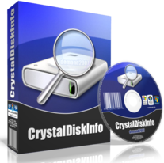
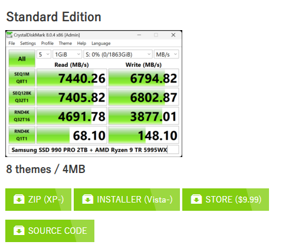
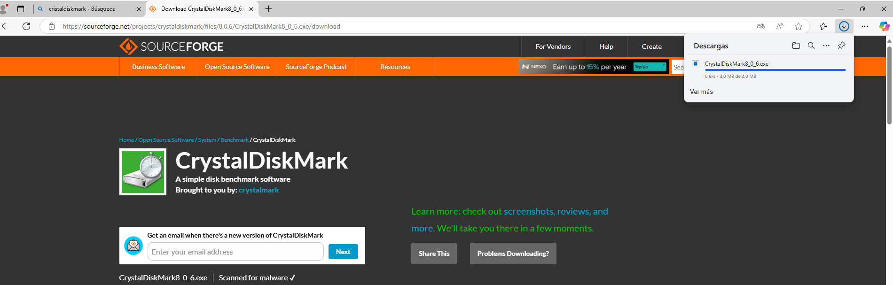
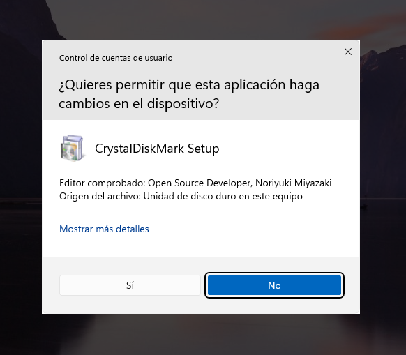
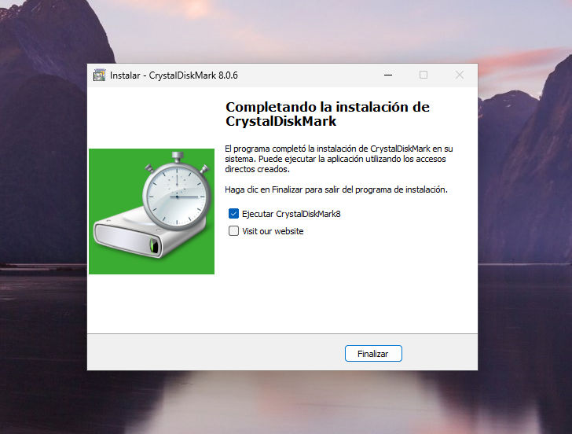
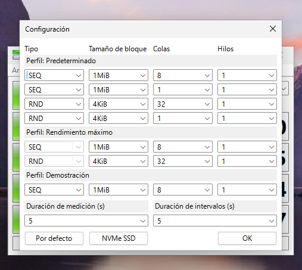
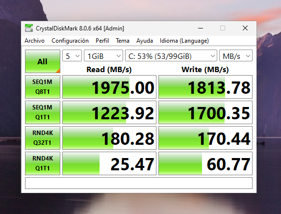
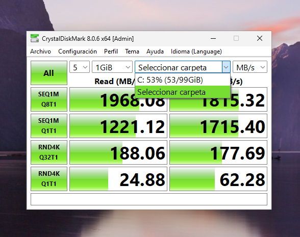

# CrystalDiskInfo

 

  

<h3>CrystalDiskInfo</h3>

Es una herramienta que mide el rendimiento de nuestro disco duro o SSD mediante diversas pruebas de velocidad de lectura y escritura.
Podemos descargarlo desde su [página oficial](https://crystalmark.info/en/download/), también tienen otro programa para visualizar el estado de nuestros discos, este sería el *CrystaldiskInfo*.
 
Navegamos por la página hasta encontrar nuestra descarga, en este caso hemos descargado esta versión, pulsamos en installer.

  

Nos llevará a la siguiente página e iniciará la descarga pasados unos segundos.

  

Ejecutamos el .exe que acabamos de descargar

  

Aceptamos los terminos, elegimos la ubicación donde queremos instalar el programa y continuamos con la instalación.
Una vez se complete nos dará dos opciones, ejecutar el programa y abrir su página web, en este caso seleccionamos ejecutar el programa.

  

Una vez ejecutamos CrystalDiskMark, seleccionamos el disco del cual queremos medir sus velocidades de lectura y escritura. Y efectuará varias pruebas por defecto, si pulsamos en configuración (control + Q) abriremos la ventana para configurar las pruebas, en el caso que queramos alguna medición más concreta.

Podemos seleccionar dos tipos de pruebas:

* SEQ - Secuencial
* RNM - Random

**El tamaño de los bloques:**

* Es la cantidad de datos que se leen o escriben **en una sola operación** durante la prueba.

**Colas e hilos:**

* **Queues (Colas)** :
  * Número de comandos que el disco puede manejar al mismo tiempo. Más colas (**Q32** ) suelen dar mejores resultados porque el disco puede organizar mejor las operaciones.
* **Threads (Hilos)** :
  * Número de procesos simultáneos que realizan las pruebas. Usar más hilos (**T2, T4** ) simula cargas de trabajo pesadas (como servidores).

  

Finalmente, podemos ejecutar la prueba pulsando **ALL**, comenzará la lectura de los bloques y nos irá mostrando el resultado, primero del apartado Lectura (Read) y luego Escritura (Write).

  

Y de esta forma podemos analizar nuestros discos del sistema. También nos ofrece la opción de analizar carpetas, el procedimiento sería el mismo.

