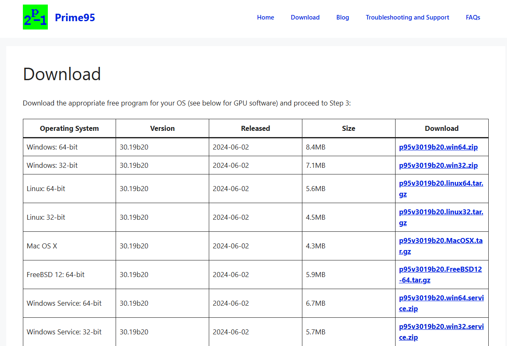
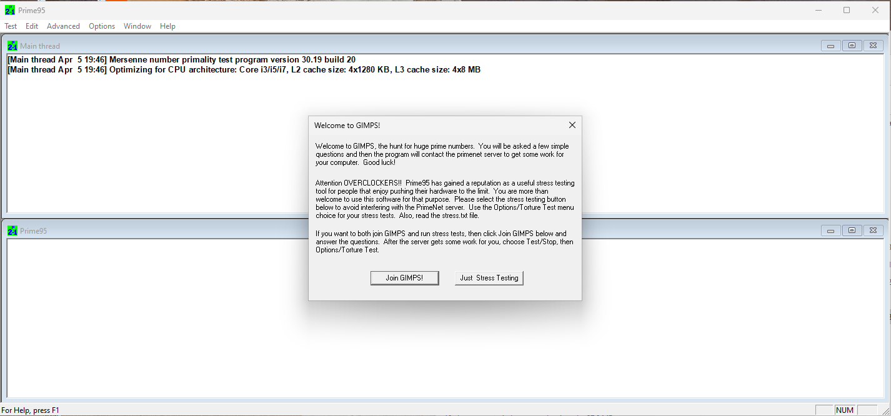
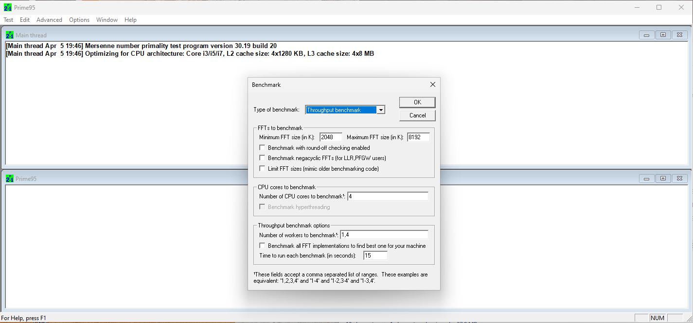
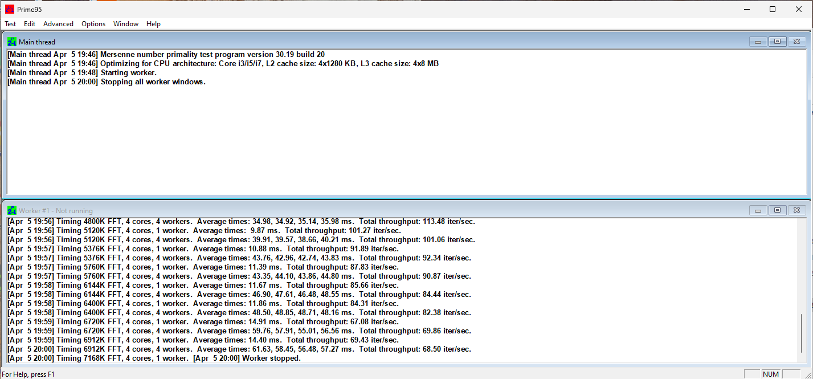

# Prime95

 

  

<h3>CrystalDiskInfo</h3>

**Prime95** (también conocido como **GIMPS - Great Internet Mersenne Prime Search** ) es un programa diseñado principalmente para buscar números primos de Mersenne (números primos de la forma 2p−1**2** **p** **−** **1**). Sin embargo, también es ampliamente utilizado como una herramienta de **estrés y benchmark** para CPUs, especialmente en entornos de overclocking y estabilidad del sistema.

Podemos descargarlo desde su [pagina oficial](https://prime95.net/download/)

 
 

Elegimos la versión acorde a nuestro sistema, en este caso, yo descargué la primera.
Este programa no requiere instalación, tenemos que extraer el .zip (con sus 3 librerias, imprescindible para su funcionamiento). En una carpeta y ejecutar desde ahí el .exe.

Una vez lo hagamos, se abrirá el programa sin necesidad de ser instalado.

 
 

Podemos realizar una prueba de estrés o un bencharmk, yo en este caso, hice un benchmark.

 
 

**Prueba de estabilidad** : Detecta errores en cálculos complejos (FFT) para verificar si un sistema overclockeado es estable.
**Calentamiento controlado** : Ejecuta cargas extremas en todos los núcleos del CPU, útil para probar sistemas de refrigeración.
**Optimización** : Ajusta automáticamente el tamaño de FFT (Transformada Rápida de Fourier) según la arquitectura del CPU y la caché.
 

En la foto podemos observar pruebas al procesador, la prueba ha sido parada manualmente después de unos minutos, porque la prueba de estrés estaba configurada para que durara una hora.

 

##### **1. Configuración del Test**

* **Arquitectura optimizada** :
  * CPU: Intel Tiger Lake-U (Core U15/17).
  * Caché: L2 (4x1.25 MB) y L3 (4x8 MB).
* **Tipo de prueba** :
  * **FFT sizes** : Desde **4800K** hasta **7168K** (tamaños grandes, que consumen más RAM y caché L3).
  * **Workers (hilos)** : 4 workers (uno por núcleo físico).

##### **2. Métricas Clave en los Resultados**

* **Tiempo por iteración (ms)** :
  * Ejemplo: `34.98 ms` para 4800K FFT.
  * Mide el tiempo que tarda la CPU en completar un cálculo de FFT. **Valores más bajos = mejor rendimiento** .
* **Throughput (Iter/sec)** :
  * Ejemplo: `113.48 Iter/sec` (iteraciones por segundo).
  * Indica cuántos cálculos completa la CPU por segundo. **Valores más altos = mayor eficiencia** .

##### **3. Tendencia Observada**

* **Desempeño inicial vs. posterior** :
  * Al inicio, el throughput es alto (ej. **113.48 Iter/sec** en 4800K FFT).
  * Luego disminuye gradualmente (ej. **68.50 Iter/sec** en 5120K FFT).
  * **Posibles causas** :
    * **Thermal throttling** : La CPU reduce su velocidad por temperatura elevada.
    * **Saturación de recursos** : Los tamaños grandes de FFT (5120K+) exigen más ancho de banda de RAM/caché.
* **Inconsistencias en tiempos** :
  * Algunas iteraciones muestran tiempos anómalamente bajos (ej. `10.88 ms`).
  * **Posible error** : Podría ser un artefacto de medición o interrupción del sistema.

##### **4. Prueba Final (7168K FFT)**

* **Solo 1 worker** :
  * Se reduce la carga a un solo hilo, probablemente para probar rendimiento en operaciones secuenciales.

    

