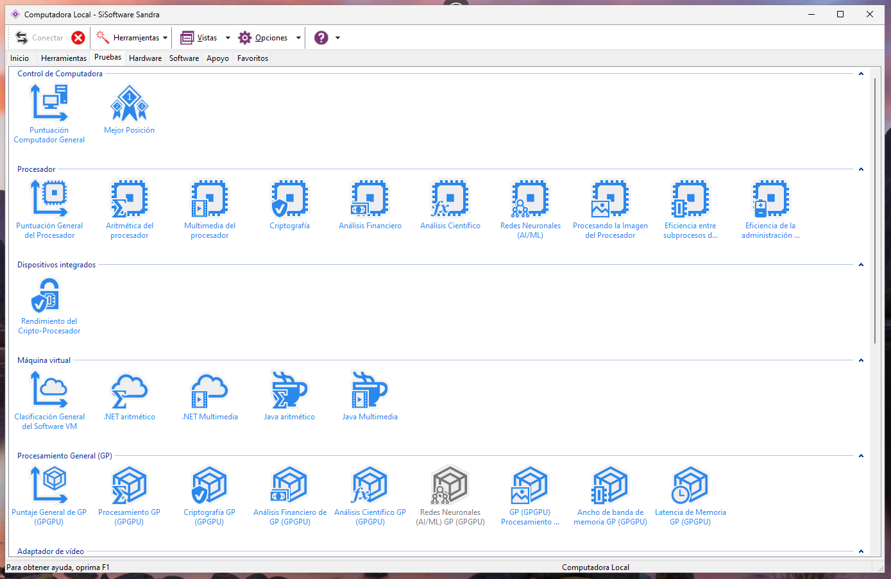

# SiSoftware Sandra Lite

 

  

<h3>SiSoftware Sandra Lite</h3>

Es una herramienta de diagnóstico, análisis y evaluación comparativa (*benchmarking*) para sistemas informáticos. Su función principal es proporcionar información detallada sobre el hardware y software de una computadora, así como evaluar su rendimiento.
En esta guía lo hemos descargado de esta [página](https://www.techspot.com/downloads/160-sisoftware-sandra-lite.html).

 
Pulsamos en download now, nos llvará a la siguiente página y en unos segundos comenzará la descarga.

 
Ejecutamos nuestra descarga y comenzará la instalación del Software y deshabilitamos los servicios remotos, ya que nosotros, solo vamos a probarlo en nuestro ordenador personal.

 
 

Continuamos la instalaciónn, eligiendo la ruta donde vamos a instalar el software Sandra Lite y al final, al ejecutarlo, nos pedira instalar un paquete más, aceptamos y continuamos con la instalación para su buen funcionamiento.

  

Una vez instalado, al ejecutarlo veremos la siguiente pantalla de inicio.

 

Si nos fijamos en la parte inferior "Tipo de módulo", vemos que tenemos el azul que son pruebas, el verde Hardware, el amarillo Software y el morado apoyo.

Si entramos en cada uno de los módulos, podemos ver las extensas pruebas que podemos realizar en nuestro equipo, por ejemplo:

### Pruebas

Aquí tenemos desde "Control de computadora", "Procesador", "Dispositivos integrados", "Máquina virtual", "Procesamiento general", etc...

Y por ejemplo analizamos cual sería el precio se nuestro procesador

 
 

### Hardware

Aquí encontramos caracteristicas como "Control de computadora", "Dispositivos integrados", "Adaptador de video", "Dispositivos de almacenamiento físico", "Red", "Periféricos", etc...

Y aquí vemos un resumen de las características generales de nuestra computadora.

  

### Software

En el apartado de Software tenemos características como "Adaptador de video", "Dispositivos de almacenamiento físicos", "Red", "Estado de ejecución", "Control de software", etc..

Aquí por ejemplo hemos analizado el uso de la memoria RAM

 

Monitorización de procesos del sistema

 

Información sobre los usuarios del sistema

 

Las variables de entorno de nuestro sistema

  

### Apoyo

Y por último tendríamos el apartado de apoyo en el que tenemos "Control de la computadora" y "Control de Programa".

 

Donde podemos ver registros de ventos del sistema, configurar el registro del sistema, etc..

